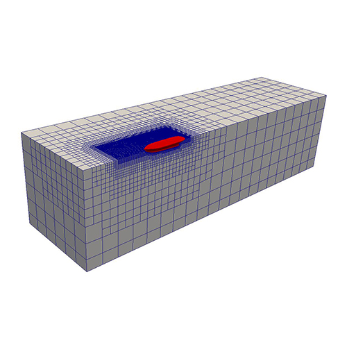

[![Contributors][contributors-shield]][contributors-url]
[![Forks][forks-shield]][forks-url]
[![Stargazers][stars-shield]][stars-url]
[![Issues][issues-shield]][issues-url]
[![MIT License][license-shield]][license-url]
[![LinkedIn][linkedin-shield]][linkedin-url]

<!-- PROJECT LOGO -->
 

  

  <h3 align="center">Gemi  ve Deniz Yapıları Hidrodinamiği</h3>

<!-- TABLE OF CONTENTS -->
## İçindekiler

1. [Çevresel koşulların tasarıma etkisi](CevreselKosullar.ipynb)
    1. Rüzgar
    2. Akıntı ve gelgit
    3. [Dalga](dalga.ipynb)
        1. Dalga kuramları
        2. Basit dalgalar ve karışık deniz modeli
        3. Belirli bir konum için dalga paremetrelerinin hesabı
    4. Kar ve buz
    5. Yer titreşimleri
    6. Hava ve su sıcaklığı
    7. Deniz suyu koşulları
2. Gemilerin Hidrodinamiği
    1. Teoriler
    2. 6 SD gemi hareketleri
    3. Ek-kütle ve sönüm hesabı
    4. Düzgün ve karışık dalgalarda gemi hareketleri
    5. Gemi hareketlerinden dolayı oluşan ivme ve kuvvetler
    6. Yalpa hareketi ve dinamik stabilite
    7. Denizcilik performansının tanımı
    8. Geminin denizcilik performansını arttıracak yöntemler
    9. Gemi manevrası
    10. Gemi-dümen etkileşimi ve dümen dizaynı
    11. Gemi model deneyleri
3. Deniz yapılarının hidrodinamiği
    1. Teoriler
    2. Küçük ve büyük cisimlere gelen dalga kuvvetlerinin hesaplanması
    3. Sabit ve hareketli deniz yapılarının dinamik analizi
    4. Ek-kütle ve sönüm hesabı
    5. Düzgün ve karışık dalgaların etkisinin incelenmesi
    6. Deniz yapısının ivmeleri ve karşılaşılan kuvvetler
    7. Tek ve çok noktalı bağlama sistemleri
    8. Deniz yapısı model deneyleri

# Bize hız kazandıracak basit araçlarımız

Karşılaştığımız mühendislik problemlerini analitik olarak çözemediğimizde kullanacağımız sayısal yöntemleri uygularken ve bu yöntemleri öğrenirken bize hız kazandırabilecek ve işlerimizi kolaylaştırabilecek çeşitli araçlar mevcut. Bu araçlarla ilgili kısa bilgileri burada paylaştım.

- Python 3, mühendislik problemlerini çözerken kullanabileceğimiz öğrenmesi çok kolay ve güçlü bir programlama dilidir. Python ücretsiz bir çok araca sahip ve Scipy, Numpy, Matplotlib vb. kuvvetli kütüphaneleri ile birçok problemi hızlı şekilde çözmeye imkan tanımaktadır.

- OpenFOAM, C++ temelli açık kaynak hesaplamalı akışkanlar dinamiği kodudur.

- Ansys AQWA, gemi ve deniz yapılarında; dalga, rüzgâr ve akıntının yapıya olan hidrodinamik etkileri ve bu etkilerden dolayı yapının vereceği tepkileri (hareketleri) hesaplama kabiliyeti olan 3 boyutlu panel metod ve potansiyel teoriyi kullanan bir mühendislik yazılımıdır.

- Maxsurf Seakeeper, narin deniz araçlarının denizcilik hesapları için dilim teorisini kullanan bir mühendislik yazılımıdır.

  

# Referans Kaynaklar

- Sükan, L. M., Açık Deniz Yapılarının Hidrodinamiği, İTÜ Gemi İnşaatı ve Deniz Bilimleri Fakültesi yayını, No.5, 1985.
- Newman, J.N., Marine Hydrodynamics. Cambridge, MA: MIT Press, 2018.
- Goda, Y., 2010. Random seas and design of maritime structures. 3rd edition.World Scientific, Singapore. 
- Kim, C. H., 2008. Non-linear waves and offshore structures. World Scientific, Singapore. 
- Kim, Y. C., 2011. Coastal and ocean engineering practice. World Scientific, Singapore.
- Clauss, G., Lehmann, F., ve Östergaard, C. : Offshore Structures, Volume I, Springer Verlag, Berlin, Heidelberg, 1992.
- Chakrabarti, S. K., Hydrodynamics of Offshore Structures, Springer-Verlag, Berlin, Heidelberg, 1987.
- Faltinsen, O. M., Sea Loads on Ships and Offshore Structures, Cambridge University Press, 1993. 
- Dean, R. G. ve Dalrymple, R. A., Water Wave Mechanics for Engineers and Scientists, World Scientific Publishing Co. Pte. Ltd., Singapore, 1998. 
- Bertram, V., Practical Ship Hydrodynamics, Butterworth-Heinemann, Oxford, 2000. 
- Robert, E. R., Elements of Ocean Engineering, SNAME Publ., 1997. 
- Chakrabarti, S. K. (Editör), Handbook of Offshore Engineering Vol I ve II, Elsevier Ltd. Publ., 2005.
- Bhattacharyya, Rameswar (1978) "Dynamics of Marine Vehicles", John Wiley & Sons.  

- Lewis, E. V. (Editör), Principles of Naval Architecture Vol III - Motions in Wavesand Controllability, SNAME, 1989.
- Journée, J.M.J.(2001) Theoretical Manual of SEAWAY Release 4.19, http://www.ocp.tudelft.nl/mt/journee.
- Sabersky, Rolf H., et al. Fluid Flow. 4th ed. Upper Saddle River, NJ: Prentice Hall, 1999.

<!-- ABOUT THE PROJECT -->

## Hakkında
Bu repo gemi mühendisleri için gemi ve deniz yapıları hidrodinamiği içeriklerinden oluşturulmuştur.

<!-- LICENSE -->
## Lisans

Bu repo'daki tüm içerikler özgürce kullanılabilir ve paylaşılabilir.

<!-- CONTACT -->
## İletişim

Baran Serdar Sarıoğlu - sariogluba@itu.edu.tr

Proje Linki: [https://github.com/sariogluba/sayisalyontemler](https://github.com/sariogluba/sayisalyontemler)

<!-- MARKDOWN LINKS & IMAGES -->
<!-- https://www.markdownguide.org/basic-syntax/#reference-style-links -->
[contributors-shield]: https://img.shields.io/github/contributors/othneildrew/Best-README-Template.svg?style=flat-square
[contributors-url]: https://github.com/sariogluba/sayisalyontemler
[forks-shield]: https://img.shields.io/github/forks/othneildrew/Best-README-Template.svg?style=flat-square
[forks-url]: https://github.com/sariogluba/sayisalyontemler
[stars-shield]: https://img.shields.io/github/stars/othneildrew/Best-README-Template.svg?style=flat-square
[stars-url]: https://github.com/sariogluba/sayisalyontemler
[issues-shield]: https://img.shields.io/github/issues/othneildrew/Best-README-Template.svg?style=flat-square
[issues-url]: https://github.com/sariogluba/sayisalyontemler
[license-shield]: https://img.shields.io/github/license/othneildrew/Best-README-Template.svg?style=flat-square
[license-url]: https://github.com/sariogluba/sayisalyontemler
[linkedin-shield]: https://img.shields.io/badge/-LinkedIn-black.svg?style=flat-square&logo=linkedin&colorB=555
[linkedin-url]: https://linkedin.com/in/baran-serdar-s-22481059/
